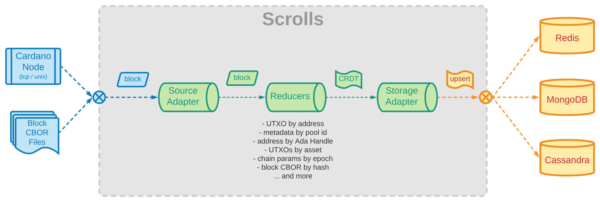
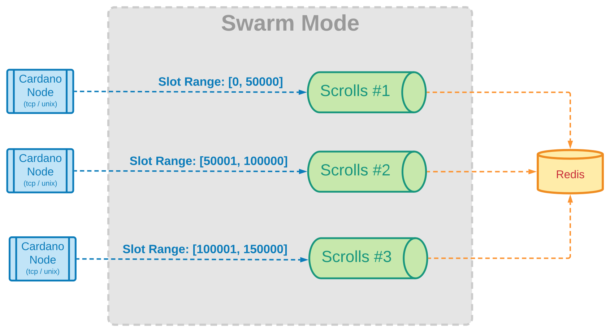

<div align="center">
    
    
    <hr />
        <h3 align="center" style="border-bottom: none">Read-optimized cache of Cardano on-chain entities</h3>
        
        
    <hr/>
</div>

## Intro

_Scrolls_ is a tool for building and maintaining read-optimized collections of Cardano's on-chain entities. It crawls the history of the chain and aggregates all data to reflect the current state of affairs. Once the whole history has been processed, _Scrolls_ watches the tip of the chain to keep the collections up-to-date.

Examples of collections are: "utxo by address", "chain parameters by epoch", "pool metadata by pool id", "tx cbor by hash", etc.

> In other words, _Scrolls_ is just a map-reduce algorithm that aggregates the history of the chain into use-case-specific, key-value dictionaries.

:warning: this tool is under heavy development. Library API, configuration schema and storage structure may vary drastically. Several important features are still missing. Use at your own peril.

## Storage

Storage backends are "pluggable", any key-value storage mechanism is a potential candidate. Our backend of preference is Redis (and TBH, the only one implemented so far). It provides a very high "read" throughput, it can be shared across the network by multiple clients and can be used in cluster-mode for horizontal scaling.

We also understand that a memory db like Redis may be prohibitive for some use-cases where storage optimization is more important than read-latency. The goal is to provide other backend options within the realm of NoSQL databases better suited for the later scenarios.

## About CRDTs

The persistence data model does heavy use of [CRDTs](https://en.wikipedia.org/wiki/Conflict-free_replicated_data_type) (Conflict-free replicated data types) and idempotent calls, which provide benefits for write concurrency and rollback procedures.

For example, CRDTs allow us to re-build the indexes by spawning several history readers that crawl on-chain data concurrently from different start positions. This provides a sensible benefit on collection-building time. We call this approach "swarm mode".

TODO: explain future plan to leverage CRDTs for rollback checkpoints.

## Accessing the Data

_Scrolls_ doesn't provide any custom client for accessing the data, it relies on the fact that the canonical clients of the selected backends are ubiquitous, battle-tested and relatively easy to use. By knowing the structure of the stored keys/values, a developer should be able to query the data directly from Redis.

TODO: reference specs for each key/value

## Filtering

Not all data is important in every scenario. Every collection in _Scrolls_ is disabled by default and needs to be opted-in via configuration for it to be processed and stored. Some collections are more storage-hungry than others (eg: "Block CBOR by Hash"), plan ahead to avoid resource exhaustion.

Within the scope of a particular collection, further filtering can be specified depending on the nature of the data being aggregated. For example, the "UTXOs by Address" collection can be filtered to only process UTXO from a set of predetermined addresses.

TODO: Document filtering options per collection

## How it Works

Scrolls is a pipeline that takes block data as input and outputs DB update commands. The stages involved in the pipeline are the following:

- Source Stages: are in charge of pulling data block data. It might be directly from a Cardano node (local or remote) or from some other source. The requirement is to have the raw CBOR as part of the payload.
- Reducer Stages: are in charge of applying the map-reduce algorithm. They turn block data into CRDTs commands that can be later merged with existing data. The map-reduce logic will depend on the type of collection being built. Each reducer stage handles a single collection. Reducers can be enabled / disabled via configuration.
- Storage Stages: receive the generic CRDT commands and turns them into DB-specific instructions that are then executed by the corresponding engine.



## Feature Status

- [ ] Collections
  - [x] UTXOs by Address
  - [x] Address by Tx Output
  - [x] Tx CBOR by Hash
  - [x] Tx Count by Address
  - [x] Chain Point by Tx Hash
  - [x] Balance by Address
  - [x] Pool Id by Stake Address
  - [ ] Pool Metadata by Pool Id
  - [ ] Chain Parameters by Epoch
  - [ ] UTXOs by Asset
  - [ ] Block Hash by Tx Hash
  - [ ] Block Hashes by Epoch
  - [ ] Block Header by Block Hash
  - [ ] Tx Hashes by Block Hash
  - [ ] Ada Handle by Address
  - [ ] Address by Ada Handle
  - [ ] Block CBOR by Hash
  - [ ] Metadata by Tx Hash
  - [ ] Feature requests open
- [ ] Data Sources
  - [x] Node-to-Node ChainSync + Blockfetch
  - [ ] Node-to-Client ChainSync
  - [ ] Oura Kafka Topic
  - [ ] Raw-CBOR Block files
- [ ] Storage Backend
  - [x] Redis
  - [ ] MongoDB
  - [ ] Cassandra
  - [ ] AWS DynamoDB
  - [ ] GCP BigQuery
  - [ ] Firestore
  - [ ] Azure CosmoDB
  - [ ] Feature requests open
- [ ] Filtering Options
  - [x] By Input / Output Address
  - [x] By Withdrawal Address
  - [x] By Collateral Address
  - [x] By Block Slot Bounds
  - [ ] By Metadata Label
  - [ ] By Mint Policy / Asset
  - [ ] By Pool

## Testdrive

In the `testdrive` folder you'll find a minimal example that uses docker-compose to spin up a local Redis instance and a Scrolls daemon. You'll need Docker and docker-compose installed in your local machine. Run the following commands to start it:

```sh
cd testdrive
docker-compose up
```

You should see the logs of both _Redis_ and _Scrolls_ crawling the chain from a remote relay node. If you're familiar with Redis CLI, you can run the following commands to see the data being cached:

```sh
redis:6379> KEYS *
1) "c1.addr1qx0w02a2ez32tzh2wveu80nyml9hd50yp0udly07u5crl6x57nfgdzya4axrl8mfx450sxpyzskkl95sx5l7hcfw59psvu6ysx"
2) "c1.addr1qx68j552ywp6engr2s9xt7aawgpmr526krzt4mmzc8qe7p8qwjaawywglaawe74mwu726w49e8e0l9mexcwjk4kqm2tq5lmpd8"
3) "c1.addr1q90z7ujdyyct0jhcncrpv5ypzwytd3p7t0wv93anthmzvadjcq6ss65vaupzmy59dxj43lchlra0l482rh0qrw474snsgnq3df"
4) "c1.addr1w8vg4e5xdpad2jt0z775rt0alwmku3my2dmw8ezd884zvtssrq6fg"
5) "c1.addr1q9tj3tdhaxqyph568h7efh6h0f078m2pxyd0xgzq47htwe3vep55nfane06hggrc2gvnpdj4gcf26kzhkd3fs874hzhszja3lh"
6) "c1.addr1w8tqqyccvj7402zns2tea78d42etw520fzvf22zmyasjdtsv3e5rz"
redis:6379> SMEMBERS c1.addr1w8tqqyccvj7402zns2tea78d42etw520fzvf22zmyasjdtsv3e5rz
1) "2548228522837ea580bc55a3e6a09479deca499b5e7f3c08602a1f3191a178e7:20"
2) "04086c503512833c7a0c11fc85f7d0f0422db9d14b31275b3d4327c40c6fd73b:25"
redis:6379>
```

Once you're done with the testdive, you can clean your environment by running:

```sh
docker-compose down
```

## Installing

We currently provide the following ways to install _Scrolls_:

- Using one of the pre-compiled binaries shared via [Github Releases](https://github.com/txpipe/scrolls/releases)
- Using the Docker image shared via [Github Packages](https://github.com/txpipe/scrolls/pkgs/container/scrolls)
- By compiling from source code using the instructions provided in this README.


## Configuration

This is an example configuration file:

```toml
# get data from a relay node
[source]
type = "N2N"
address = "relays-new.cardano-mainnet.iohk.io:3001"

# You can optionally enable enrichment (local db with transactions), this is needed for some reducers
[enrich]
type = "Sled"
db_path = "/opt/scrolls/sled_db"

# enable the "UTXO by Address" collection
[[reducers]]
type = "UtxoByAddress"
# you can optionally prefix the keys in the collection
key_prefix = "c1"
# you can optionally only process UTXO from a set of predetermined addresses
filter = ["addr1qy8jecz3nal788f8t2zy6vj2l9ply3trpnkn2xuvv5rgu4m7y853av2nt8wc33agu3kuakvg0kaee0tfqhgelh2eeyyqgxmxw3"]

# enable the "Point by Tx" collection
[[reducers]]
type = "PointByTx"
key_prefix = "c2"

# store the collections in a local Redis
[storage]
type = "Redis"
connection_params = "redis://127.0.0.1:6379"

# start reading from an arbitrary point in the chain
[intersect]
type = "Point"
value = [57867490, "c491c5006192de2c55a95fb3544f60b96bd1665accaf2dfa2ab12fc7191f016b"]

# let Scrolls know that we're working with mainnet
[chain]
type = "Mainnet"
```

## Compiling from Source

To compile from source, you'll need to have the Rust toolchain available in your development box. Execute the following command to clone and build the project:

```sh
git clone https://github.com/txpipe/scrolls.git
cd scrolls
cargo build
```

## FAQ

### Don't we have tools for this already?

Yes, we do. We have excellent tools such as: [Kupo](https://github.com/CardanoSolutions/kupo), dcSpark's [Carp](https://github.com/dcSpark/carp) or [Db-Sync](https://github.com/input-output-hk/cardano-db-sync). Even the Cardano node itself might work as a source for some of the collections. Every tool is architected with a set of well-understood trade-offs. We believe _Scrolls_ makes sense as an addition to the list because assumes a particular set of trade-offs:

- network storage over local storage: _Scrolls_ makes sense if you have multiple distributed clients working in a private network that want to connect to the same data instance.
- read latency over data normalization: _Scrolls_ works well when you need to answer simple questions, like a lookup table. It won't work if you need to create joins or complex relational queries.
- data cache over data source: _Scrolls_ aims at being a "cache" of data, not the actual source of data. It has an emphasis on easy and fast reconstruction of the collections. It promotes workflows where the data is wiped and rebuilt from scratch whenever the use-case requires (such as adding / removing filters).
- Rust over Haskell: this is not a statement about the languages, both are great languages, each one with its own set of trade-offs. Since most of the Cardano ecosystem is written in Haskell, we opt for Rust as a way to broaden the reach to a different community of Rust developers (such as the authors of this tool). _Scrolls_ is extensible, it can be used as a library in Rust projects to create custom cache collections.
- bring your own db: storage mechanism in _Scrolls_ are pluggable, our goal is to provide a tool that plays nice with existing infrastructure. The trade-off is that you end up having more moving parts.

### How does this tool compare to _Oura_?

There's some overlap between _Oura_ and _Scrolls_. Both tools read on-chain data and output some data results. The main difference is that Oura is meant to **_react_** to events, to watch the chain and actuate upon certain patterns. In contrast, _Scrolls_ is meant to provide a snapshot of the current state of the chain by aggregating the whole history.

They were built to work well together. For example, let's say that you're building an app that uses Oura to process transaction data, you could then integrate _Scrolls_ as a way to lookup the source address of the transaction's input.

### How do I read the data using Python?

Assuming you're using Redis as a storage backend (only one available ATM), we recommend using [redis-py](https://github.com/redis/redis-py) package to talk directly to the Redis instance. This is a very simple code snippet to query a the UTXOs by address.

```python
>>> import redis
>>> r = redis.Redis(host='localhost', port=6379, db=0)
>>> r.smembers("c1.addr1w8tqqyccvj7402zns2tea78d42etw520fzvf22zmyasjdtsv3e5rz")
{b'2548228522837ea580bc55a3e6a09479deca499b5e7f3c08602a1f3191a178e7:20', b'04086c503512833c7a0c11fc85f7d0f0422db9d14b31275b3d4327c40c6fd73b:25'}
```

 The Redis operation being used is `smembers` which return the list of members of a set stored under a particular key. In this case, we query by the value `c1.addr1w8tqqyccvj7402zns2tea78d42etw520fzvf22zmyasjdtsv3e5rz`, where `c1` is the key prefix specified in the config for our particular collection and `addr1w8tqqyccvj7402zns2tea78d42etw520fzvf22zmyasjdtsv3e5rz` is the address we're interested in querying. The response from redis is the list of UTXOs (in the format `{tx-hash}:{output-index}`) that are associated with that particular address.

### How do I read the data using NodeJS?

TODO

### What is "swarm mode"?

Swarm mode is a way to speed up the process of rebuilding collection from scratch by splitting the tasks into concurrent instances of the _Scrolls_ daemon by partitioning the history of the chain into smaller fragments.


